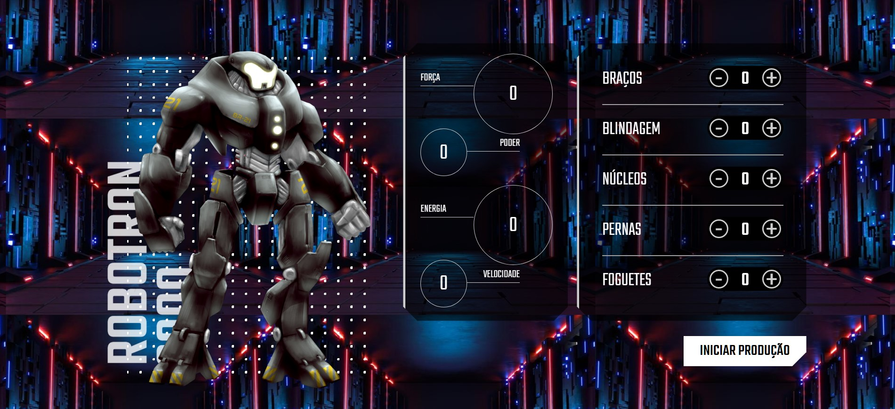
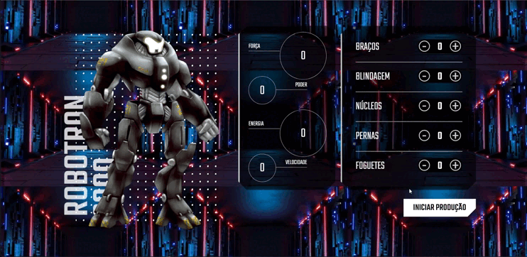

# Projeto-RoboTron-2.0

Projeto realizado com intuito de aprender a manipular HTML através do JavaScrip, projeto da formação Alura de JavaScrip "JavaScrip: manipulando o DOM"

## Gif do projeto

## Linguagens Utilizadas

* Html 
* CSS 
* JavaScript
